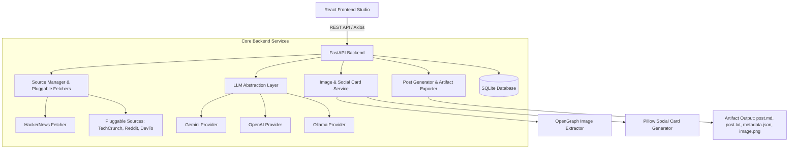

# Automated LinkedIn Tech Post Generator

An automated, clean-architecture application that discovers trending technology news from Hacker News (and pluggable sources), extracts key insights, summarizes content, and generates professional, high-converting LinkedIn posts (under 180 words, dynamic 5–8 hashtags, multiple writing tones) complete with social media card graphics and complete export artifacts.

---

## Architecture Diagram



---

## Features

- **Hacker News Live Discovery & Ranking**: Automatically ranks front-page stories balancing score, comment density, and exponential recency decay.
- **AI Layer Abstraction**: Polymorphic LLM integration supporting Google Gemini, OpenAI (GPT-4o), and local Ollama models.
- **Multi-Tone Writing Options**: Customizes output voice for **Professional**, **Founder**, **Developer**, or **Investor** audiences.
- **Strict Quality Constraints**: Enforces <180 words, compelling non-clickbait hooks, zero AI fluff ("In today's fast-paced digital world..."), and 5–8 dynamic hashtags.
- **Image Fallback System**: Automatically downloads OpenGraph images or generates a sleek 1200x630 dark-themed social card using Pillow (PIL).
- **Artifact Exporter**: Saves every generated post into structured output directories containing `post.md`, `post.txt`, `metadata.json`, and image files.
- **Post History**: Embedded SQLite storage for instant historical post lookup and search.
- **React Frontend Studio**: Dark-mode desktop interface featuring live LinkedIn card previews, one-click clipboard copying, and export options.

---

## Directory & Folder Structure

```
linkedin-post-creator/
├── backend/
│   ├── app/
│   │   ├── main.py                  # FastAPI application & middleware
│   │   ├── config.py                # Environment & settings configuration
│   │   ├── database.py              # Async SQLite engine setup
│   │   ├── models/                  # Domain schemas & DB ORM models
│   │   ├── sources/                 # Pluggable news sources (Hacker News)
│   │   ├── scraper/                 # Article scraper & Pillow card generator
│   │   ├── ai/                      # Gemini, OpenAI, Ollama LLM abstraction
│   │   ├── prompts/                 # Jinja2 / Python prompt templates
│   │   ├── services/                # Post generator & artifact exporter
│   │   └── api/                     # REST API Routers (stories, posts, health)
│   ├── tests/                       # Pytest unit test suite
│   ├── pytest.ini
│   └── requirements.txt
├── frontend/
│   ├── src/
│   │   ├── components/              # Header, StoryCard, PostPreview, ToneSelector, History
│   │   ├── api/                     # Axios API client
│   │   ├── types/                   # TypeScript interfaces
│   │   └── App.tsx                  # Studio dashboard
│   ├── package.json
│   └── vite.config.ts
├── sample_output/                   # Sample post deliverable artifacts
│   ├── post.md
│   ├── post.txt
│   ├── metadata.json
│   └── image.png
├── README.md
└── INSTALLATION.md
```

---

## Extending News Sources (Pluggable Architecture)

Adding a new news source (e.g. TechCrunch, Reddit, GitHub Trending) is straightforward:

1. Create a new class extending `BaseSourceFetcher` in `backend/app/sources/`:

```python
from app.sources.base import BaseSourceFetcher
from app.models.domain import Story

class TechCrunchFetcher(BaseSourceFetcher):
    @property
    def name(self) -> str:
        return "TechCrunch"

    async def fetch_trending_stories(self, limit: int = 20) -> list[Story]:
        # Implement RSS / API fetching logic here
        return []
```

2. Register the fetcher in `backend/app/sources/registry.py`:

```python
from app.sources.techcrunch import TechCrunchFetcher
source_registry.register(TechCrunchFetcher())
```

---

## How to Run with `uv`

### 1. Command Line Post Generation (CLI)

Run directly using `uv`:

```bash
cd backend
uv run python -m app.cli --tone developer
```

Options:
- `--tone`: `professional` (default), `founder`, `developer`, `investor`
- `--source`: `hacker_news` (default)
- `--story-id`: Optional specific Hacker News story ID

### 2. Output Artifacts

Every execution automatically generates artifacts in `output/<timestamp>_<slug>/`:
- `post.md` (Markdown caption + metadata links)
- `post.txt` (Clean copy-paste text)
- `metadata.json` (Structured summary & story parameters)
- `social_card.png` (High-res 1200x630 social media image)


---

## License

MIT License. Built for production automation.
