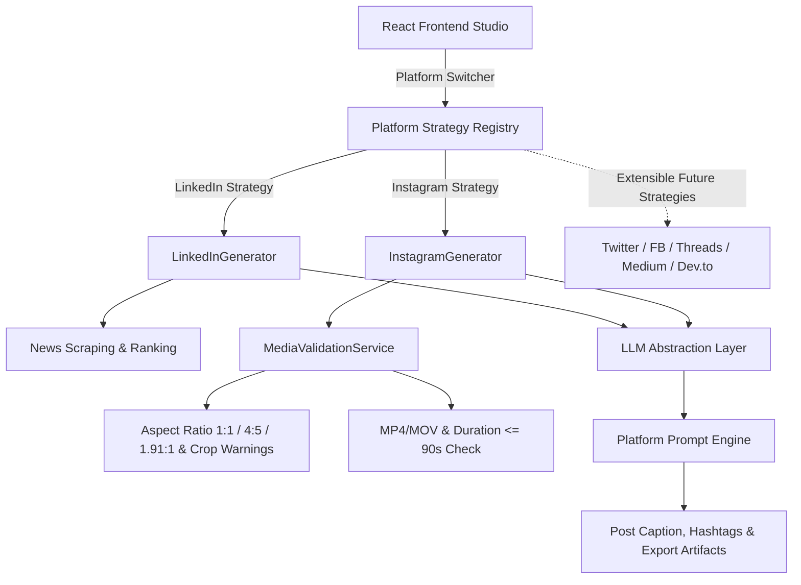

# AI Social Post Generator (Multi-Platform Studio)

An automated, clean-architecture application that generates engaging, high-converting social media content across multiple platforms (**LinkedIn** and **Instagram**, with extensible architecture for **X/Twitter**, **Facebook**, **Threads**, **Medium**, and **Dev.to**).

---

## Architecture Diagram & Strategy Pattern



---

## Supported Social Platforms

| Platform | Input Workflow | AI Output Format | Special Features |
|---|---|---|---|
| **LinkedIn** (Existing) | Trending News (Hacker News / CNET) or Custom Title + Tone Selection | Professional hook, 2-4 short paragraphs, practical insight, CTA (<180 words), 5-8 topic hashtags | Auto social image card generation, tone personas (Founder, Developer, Investor, Professional), direct publishing |
| **Instagram** (New) | Media Upload (Image/Reel Video) + Multiline Content Prompt | Creative caption (max 2 concise sentences), friendly/engaging tone, CTA, 3–6 dynamic hashtags | Real-time aspect ratio checks (1:1, 4:5, 1.91:1), crop warnings, video Reel duration validation, prompt sample chips |
| **X (Twitter)** (Future) | Pluggable Strategy | Single tweet or thread format | Ready for strategy registration |
| **Facebook / Threads / Medium / Dev.to** (Future) | Pluggable Strategy | Platform-specific writing tone & format | Ready for strategy registration |

---

## Key Features & Capabilities

- **Strategy Pattern Architecture**: Modular `SocialPlatformGenerator` interface and `PlatformRegistry` enabling new platforms to be added without major code changes.
- **Dedicated Prompt Engineering**: Independent prompt modules per platform (`linkedin_prompt.py`, `instagram_prompt.py`).
- **Media Validation Service**: Reusable `MediaValidationService` inspecting file sizes, JPEG/PNG/WEBP images, aspect ratios (1:1 square, 4:5 portrait, 1.91:1 landscape), crop warnings, and MP4/MOV video Reel durations up to 90 seconds.
- **Configurable Limits**: Platform settings stored centrally in `config.py` (max image size, max video size, hashtag count ranges, caption length limits).
- **Multi-Model Support**: Supports Google Gemini, OpenAI (GPT-4o), Ollama local LLMs, and LMStudio out-of-the-box.
- **Export & Clipboard Options**: Copy caption, copy hashtags, copy all, download `.txt` artifacts.

---

## Folder Structure

```
linkedin-post-creator/
├── backend/
│   ├── app/
│   │   ├── main.py                  # FastAPI application & router mounts
│   │   ├── config.py                # Platform limits & settings configuration
│   │   ├── database.py              # Async SQLite engine setup
│   │   ├── models/                  # Domain schemas, MediaValidationResult & DB ORM models
│   │   ├── platforms/               # Strategy Pattern platform generators
│   │   │   ├── base.py              # SocialPlatformGenerator abstract interface
│   │   │   ├── linkedin.py          # LinkedInGenerator strategy
│   │   │   ├── instagram.py         # InstagramGenerator strategy
│   │   │   └── registry.py          # PlatformRegistry factory
│   │   ├── services/                # MediaValidationService & exporter
│   │   ├── scraper/                 # Article scraper & image generator
│   │   ├── ai/                      # Gemini, OpenAI, Ollama, LMStudio providers
│   │   ├── prompts/                 # Platform prompt modules (linkedin_prompt.py, instagram_prompt.py)
│   │   └── api/                     # REST API Routers (stories, posts, media, health)
│   ├── tests/                       # Pytest unit test suite
│   │   ├── test_media_validation.py # MediaValidationService tests
│   │   ├── test_instagram_generator.py # Instagram prompt & hashtag tests
│   │   └── test_platform_strategy.py   # Strategy pattern tests
│   ├── pytest.ini
│   └── requirements.txt
├── frontend/
│   ├── src/
│   │   ├── components/              # Header (Platform Tabs), InstagramForm, InstagramPreview, PostPreview
│   │   ├── api/                     # Axios API client for multi-platform generation & media uploads
│   │   ├── types/                   # TypeScript interfaces
│   │   └── App.tsx                  # Studio dashboard
│   ├── package.json
│   └── vite.config.ts
├── README.md
└── INSTALLATION.md
```

---

## API Endpoints

- `POST /api/posts/generate`: Generate LinkedIn post via `LinkedInGenerator` strategy.
- `POST /api/posts/instagram/generate`: Generate Instagram caption & 3–6 dynamic hashtags inside it via `InstagramGenerator` strategy.
- `POST /api/media/upload`: Upload and validate image or video media against Instagram specs.
- `GET /api/posts/history`: Retrieve history of generated social posts.

---

## Unit Testing

Run unit tests via `pytest`:

```bash
cd backend
pytest
```

---

## License

MIT License. Built for production automation.
